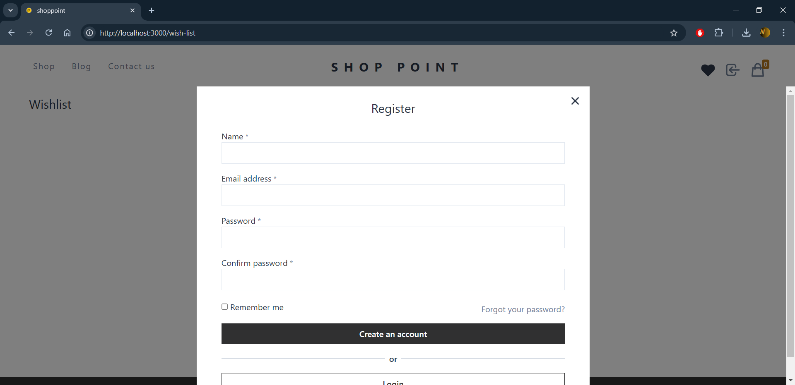
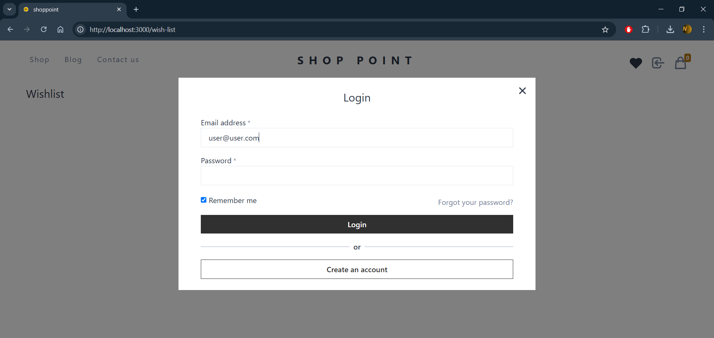
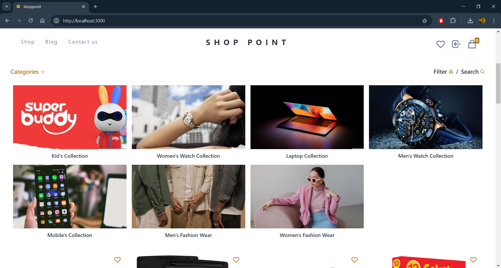
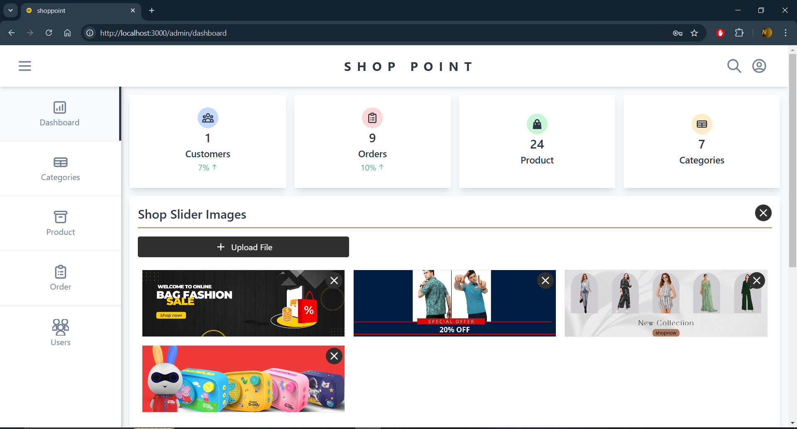

# shop-point - An E-Commerce Website 🛒 

**shop-point** is an eCommerce website that allows users to browse products, add them to their cart, and complete the checkout process using Visa. Admins can manage categories, products, orders, and users through a dedicated dashboard.

**Note**: This project is hosted on GitHub and can be cloned for local development or contribution.

## Features

### User Features:
- **Login/Signup**: Users can sign up and log in to the platform.🔐
- **Product Browsing**: Users can view products, filter by categories, and see detailed product pages.🛍️
- **Add to Cart**: Users can add products to their shopping cart and modify quantities.🛒
- **Checkout & Payment**: Users can checkout and make payments via Visa (integrated via Stripe or PayPal).💳
- **Order History**: Users can view their order history and see the status of their orders.📜

### Admin Features:
- **Admin Login**: Admins can log in to a secure dashboard.🔑
- **Dashboard**: Admins can view overall statistics such as sales, active orders, and more.📊
- **Category Management**: Admins can add, edit, or delete product categories.🏷️
- **Product Management**: Admins can add, edit, or remove products.📝
- **Order Management**: Admins can view all orders and update their status (e.g., shipped, delivered).🚚
- **User Management**: Admins can view and manage users.👤

---

## Technology Stack

- **Frontend**: React.js⚛️
- **Backend**: Node.js with Express.js 🌐
- **Database**: MongoDB 🗄️
- **Authentication**: JWT token for authentication🔑
- **Payment Integration**: PayPal for Visa card payments💳
- **Admin Dashboard**: Custom admin panel🖥️

---

## Prerequisites🧑‍💻

- Node.js ⚙️
- MongoDB 🗃️
- PayPal account for payment processing💰
- Git for version control🧑‍💻

---

## Installation Steps🏗️

Follow these steps to get your development environment up and running.

### 1. Clone the repository

### Open your terminal or command prompt and run the following command to clone the repository:

```bash
git clone https://github.com/nirajdev147/ShopPoint.git
cd ShopPoint
```

### 2. Set Up Environment Variables

1. Open your terminal or cmd and navigate to the **server** directory:

    ```bash
    cd server
    ```

2. Create the `.env` file.

3. Add the following environment variables to the `.env` file:

    ```bash
    DATABASE=enter_your_mongodb_database_id_here
    PORT=8000
    BRAINTREE_MERCHANT_ID=enter_your_braintree_merchant_id_here
    BRAINTREE_PUBLIC_KEY=enter_your_braintree_public_key_here
    BRAINTREE_PRIVATE_KEY=enter_your_braintree_private_key_here
    ```

    - Replace `enter_your_mongodb_database_id_here` with your actual MongoDB database ID or connection string.🌐
    - Replace `enter_your_braintree_merchant_id_here`, `enter_your_braintree_public_key_here`, and `enter_your_braintree_private_key_here` with your Braintree credentials.💳

4. Save the `.env` file.

## 3. Run the development server🚀

### For Server:

```bash
    cd server
    npm install
```

### For Client:

```bash
    cd client
    npm install
```

## Screenshots📸

Here’s a screenshot of the project in action:

### Register


### Login



### Homepage


### Category


### Admin Dashboard:



Feel free to fork the repository, make improvements, and submit pull requests.🎉
Enjoy building with ShopPoint!🛍️
Happy coding!😊
